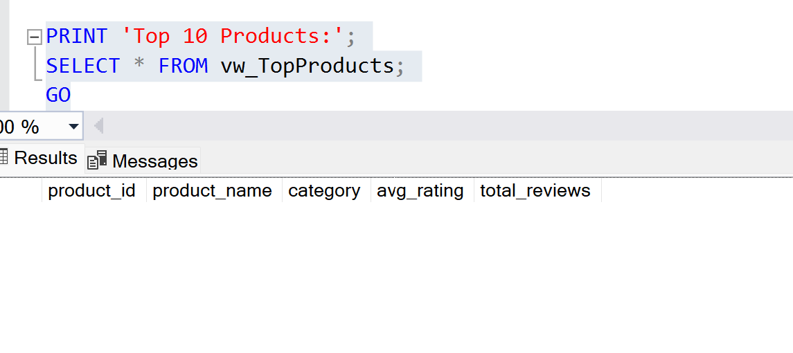
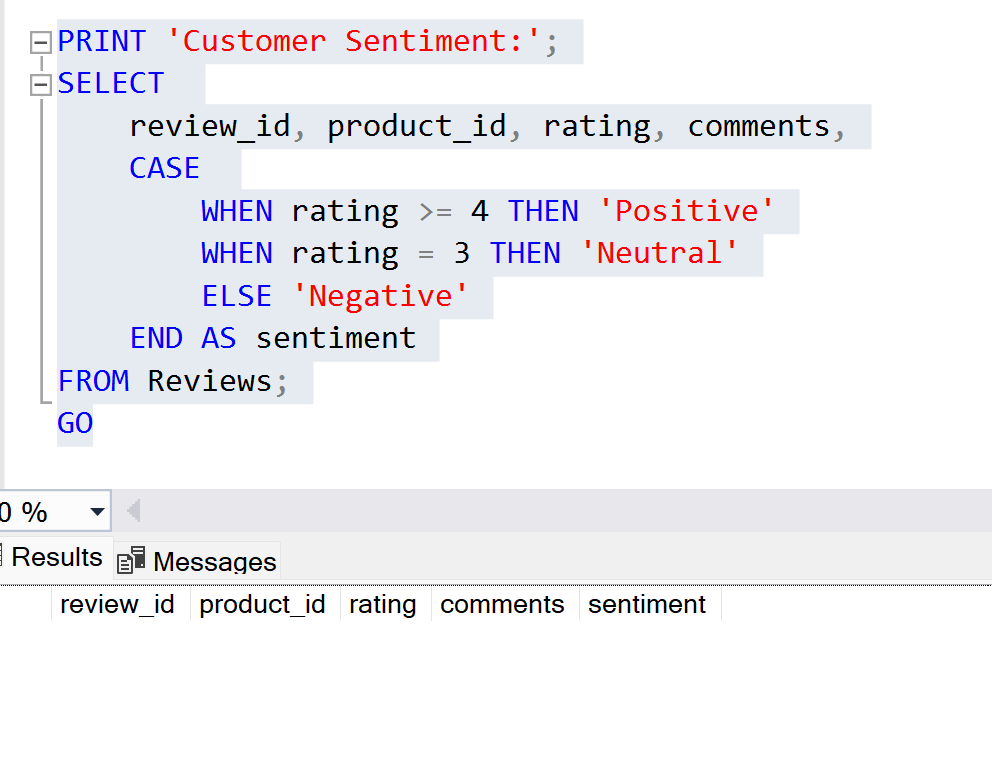

# Customer Feedback DB 

## Project Overview
This project demonstrates a **Customer Feedback Analysis Database** using SQL. It highlights skills in:

- ✅ Database design (Customers / Products / Reviews)  
- ✅ Data import & cleaning (CSV / JSON / XML using Staging tables)  
- ✅ SQL queries for Top products, Customer sentiment, and Trend analysis  
- ✅ Views & Stored Procedures for efficient analysis  

> Note: Actual data analysis and visualization are performed in the separate **data_parsing_analysis** project.

---

## Database Structure

**Main Tables (Production Tables)**

| Table Name | Description | Primary / Foreign Key |
|------------|------------|---------------------|
| `Customers` | Customer information | `customer_id` (PK) |
| `Products` | Product information | `product_id` (PK) |
| `Reviews` | Product reviews | `review_id` (PK), `customer_id` (FK), `product_id` (FK) |

**Staging Tables (for data import only)**

- `Staging_CustomerSurvey`  
- `Staging_WebFeedback`  
- `Staging_ExternalReviews`  

**Views**

- `vw_ProductReviews`: Average rating & total review count by product  
- `vw_TopProducts`: Top 10 products

---

## Sample Queries

### Top 10 Products
```sql
SELECT * FROM vw_TopProducts;
Common Complaints by Category
SELECT p.category,
       SUM(CASE WHEN r.comments LIKE '%damaged%' THEN 1 ELSE 0 END) AS Damaged,
       SUM(CASE WHEN r.comments LIKE '%late%' THEN 1 ELSE 0 END) AS Late,
       SUM(CASE WHEN r.comments LIKE '%defective%' THEN 1 ELSE 0 END) AS Defective
FROM Reviews r
JOIN Products p ON r.product_id = p.product_id
GROUP BY p.category;
Customer Sentiment Analysis
SELECT review_id, product_id, rating, comments,
       CASE WHEN rating >= 4 THEN 'Positive'
            WHEN rating = 3 THEN 'Neutral'
            ELSE 'Negative' END AS sentiment
FROM Reviews;
Data Import Example
EXEC ImportCustomerSurvey @FilePath = N'C:\Data\CustomerSurvey.csv';
This procedure imports CSV data into the Staging table, then bulk inserts it into the Reviews table.
For actual analysis, use the CSV files in the data_parsing_analysis project.
'''
## Sample Output

**Top Products & Trend Analysis**


**Customer Sentiment Analysis**


> Empty table shown as placeholder. Replace with actual data once CSV is imported.
'''

Empty table shown as placeholder. Replace with actual data once CSV is imported.

Skills Demonstrated
Database design & management

SQL query & analysis (aggregates, conditional statements, date formatting)

Data cleaning & ETL using Staging tables

Customer feedback trend & sentiment analysis

Tip: For full data analysis and visualizations, refer to the data_parsing_analysis project using the same CSV datasets.
