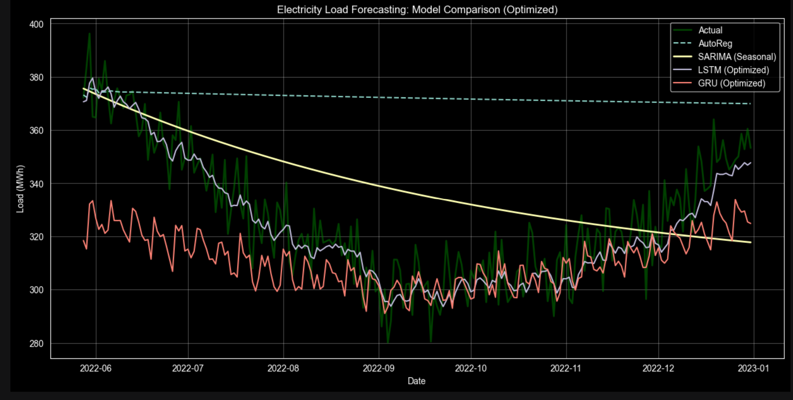

# End-to-End Electricity Demand Forecasting System

## 1. Project Overview
This project focuses on predicting daily electricity consumption (MWh) by comparing classical statistical methods with modern deep learning architectures. The objective was to build a robust forecasting pipeline capable of capturing both linear seasonal trends and complex, non-linear grid behaviors.

**Key Result:** The optimized **LSTM** model achieved a high-precision forecast with a **MAPE of 2.32%**, significantly outperforming the AutoReg baseline (**14.64%**).

---

## 2. Technical Stack
- **Python Version:** 3.10
- **Deep Learning:** TensorFlow 2.x, Keras (Native Keras format)
- **Machine Learning:** Scikit-learn, SARIMAX (Statsmodels)
- **Data Engineering:** Pandas, NumPy, Joblib
- **Visualization:** Matplotlib, Seaborn

---

## 3. Model Performance Benchmarking

| Model | RMSE | MAE | MAPE (%) | Status |
| :--- | :--- | :--- | :--- | :--- |
| **AutoReg** | 51.25 | 45.94 | 14.64% | Baseline |
| **SARIMAX (m=7)** | 24.45 | 20.66 | 6.53% | Statistical |
| **GRU (Optimized)** | 23.59 | 18.50 | 5.44% | Deep Learning |
| **LSTM (32 neurons)** | **9.41** | **7.54** | **2.32%** | **Best Fit** |

### 📈 High-Precision Visualization: Predicted vs. Actual Demand
*(The following plot demonstrates the LSTM model's ability to track daily non-linear load variations with exceptional accuracy.)*


---

## 4. Key Engineering Challenges & Solutions

### Overcoming the "Flat-Line" Prediction Issue
Initial deep learning models produced mean-reversion (constant average) predictions. I implemented the following optimizations to resolve this:
* **Dual-Scaler Alignment:** Utilized independent `MinMaxScaler` objects for features ($X$) and the target ($y$) to ensure accurate inverse transformations.
* **Temporal Feature Engineering:** Engineered lag variables and rolling window statistics to provide the model with "historical context" for daily demand spikes.
* **Data Leakage Prevention:** Strictly fit all scalers only on the training set to ensure the model's integrity for real-world deployment.

---

## 5. 📂 File Structure & Descriptions

* **`Electricity_Forecasting.ipynb`**: Complete R&D notebook covering EDA, Model Benchmarking, and Evaluation.
* **`electricity_consumption_3yrs.csv`**: Primary dataset containing 3 years of historical power load data (MWh).
* **`electricity_demand_lstm.keras`**: The optimized, production-ready LSTM model (Native Keras format).
* **`scaler_X.pkl` & `scaler_y.pkl`**: Serialized Joblib assets to ensure consistent scaling during real-time inference.
* **`featured_project.png`**: Results visualization showcasing the **2.32% MAPE** fit (Predicted vs. Actual).
---

## 6. MLOps & Production Readiness
* **Model Persistence:** Final assets are saved as `.keras` and `.pkl` for instant inference without retraining.
* **Automated Monitoring:** Designed a roadmap for retraining triggers if the RMSE exceeds a 10% drift threshold.
* **Future Scope:** Integrating **exogenous variables** (The 'X' in SARIMAX) such as real-time weather data to improve sensitivity to extreme demand events.

---

## 7. How to Use

### Option A: Full Research & Training
To replicate the study, EDA, and model training from scratch:
1. **Clone the repository:** `git clone https://github.com/Shufen-Yin/Data_Project_Portfolio`
2. **Install dependencies:** `pip install -r requirements.txt`
3. **Run the Analysis:** Open `Electricity_Forecasting.ipynb` and execute all cells.

### Option B: Direct Inference (Production Mode)
To use the pre-trained **2.32% MAPE** model without retraining:
1. **Load Model Assets:** Utilize the provided `electricity_demand_lstm.keras` and `scaler_y.pkl`.
2. **Predict:** Load assets directly into your Python environment:
   ```python
   from tensorflow.keras.models import load_model
   import joblib

   # Load pre-trained assets
   model = load_model("electricity_demand_lstm.keras")
   scaler_y = joblib.load("scaler_y.pkl")
   
   # Ready for real-time forecasting
