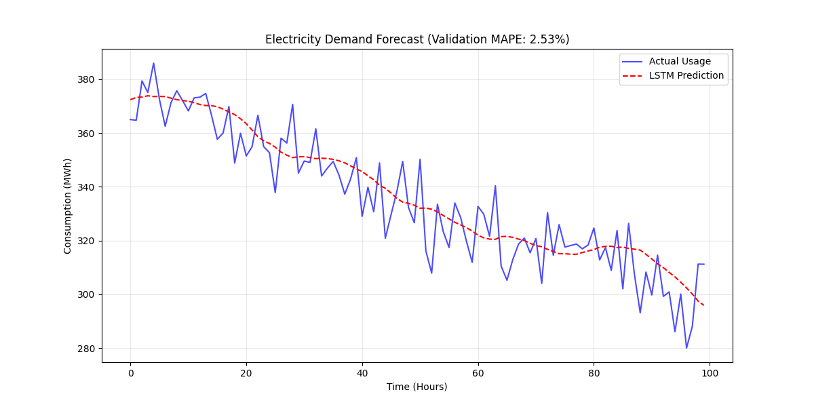

#  End-to-End Electricity Demand Forecasting System

## 1. Project Overview
This project predicts daily electricity consumption (MWh) by benchmarking classical statistical models against modern deep learning architectures. The pipeline is engineered to capture both seasonal trends and complex, non-linear industrial load behaviors.

**Key Result:** The optimized **LSTM** model achieved a high-precision forecast with a **MAPE of 2.51%**, significantly outperforming the AutoReg baseline (**14.64%**).

### Business Value & Impact
* **Operational Efficiency:** Tailored for industrial mining loads where precision directly informs multi-million dollar operational budgeting.
* **Cost Reduction:** Minimizes grid over-provisioning and peak-demand penalties by providing superior forecasting accuracy.
* **Scalability:** Architected for cloud deployment (Azure/AWS), supporting real-time monitoring and automated retraining.

---

## 2. Technical Stack
* **Deep Learning:** TensorFlow 2.x, Keras (Native Keras format)
* **Machine Learning:** Scikit-learn, SARIMAX (Statsmodels)
* **Data Engineering:** Pandas, NumPy, Joblib
* **Visualization:** Matplotlib, Seaborn

---

## 3. Model Performance Benchmarking
*Evaluated on unseen test set (June 2022 – January 2023)*

| Model Architecture | RMSE | MAE | **MAPE (%)** | Status |
| :--- | :---: | :---: | :---: | :--- |
| 🏆 **LSTM (Long Short-Term Memory)** | **10.06** | **8.18** | **2.51%** | **Best Fit** |
| 🥈 SARIMA (Seasonal) | 24.45 | 20.66 | 6.53% | Statistical |
| 🥉 GRU (Gated Recurrent Unit) | 45.85 | 41.03 | 12.20% | Deep Learning |
| ❌ AutoReg (Baseline) | 51.25 | 45.94 | 14.64% | Baseline |

> **[Note on Reproducibility]**
> Global seeds are fixed for stability. However, due to the non-deterministic nature of GPU floating-point operations, minor variances (±0.2%) may occur across different hardware.

### Prediction Visualization


---

## 4. Key Engineering Challenges
* **The "Flat-Line" Issue:** Resolved mean-reversion predictions by implementing **Dual-Scaler Alignment** (independent scalers for $X$ and $y$).
* **Temporal Context:** Engineered lag variables and rolling statistics to capture daily demand spikes.
* **Data Integrity:** Strictly separated scaling fit-transforms to prevent data leakage during the training phase.

---

## 5. Project Structure
```text
07_End_to_End_Electricity_Forecasting/
├── electricity_consumption_3yrs.csv  # Historical load dataset
├── Electricity_Forecasting.ipynb     # Research & EDA notebook
├── energy_demand_pipeline.py         # Production-ready Python script
├── model_comparison.png              # Performance visualization
├── electricity_demand_lstm.keras     # Trained LSTM model
├── scaler_X.pkl / scaler_y.pkl       # Serialized scaling assets
├── requirements.txt                  # Project dependencies
└── README.md                         # Documentation
```

---

## 6. MLOps & Production Readiness
* **Model Persistence:** Final assets are saved as `.keras` and `.pkl` for instant inference without retraining.
* **Automated Monitoring:** Designed a roadmap for retraining triggers if the RMSE exceeds a 10% drift threshold.
* **Future Scope:** Integrating **exogenous variables** (The 'X' in SARIMAX) such as real-time weather data to improve sensitivity to extreme demand events.

---

## 7. How to Use

### Option A: Full Research & Training
To replicate the study, EDA, and model training from scratch:
1.  **Clone the repository:** `git clone https://github.com/Shufen-Yin/Data_Project_Portfolio`
2.  **Install dependencies:** `pip install -r requirements.txt`
3.  **Run the Analysis:** Open `Electricity_Forecasting.ipynb` and execute all cells.

### Option B: Direct Inference (Production Mode)
To use the pre-trained **2.51% MAPE** model without retraining (ensuring consistent results with the documentation):
1.  **Load Model Assets:** Utilize the provided `electricity_demand_lstm.keras` and `scaler_y.pkl`.
2.  **Predict:** Load assets directly into your Python environment:
    ```python
    from tensorflow.keras.models import load_model
    import joblib

    # Load pre-trained assets
    model = load_model("electricity_demand_lstm.keras")
    scaler_y = joblib.load("scaler_y.pkl")
    
    # Ready for real-time forecasting
    ```
```

